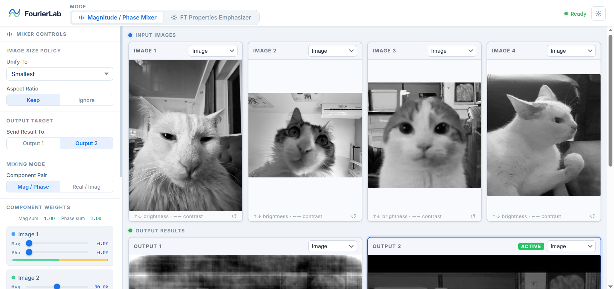
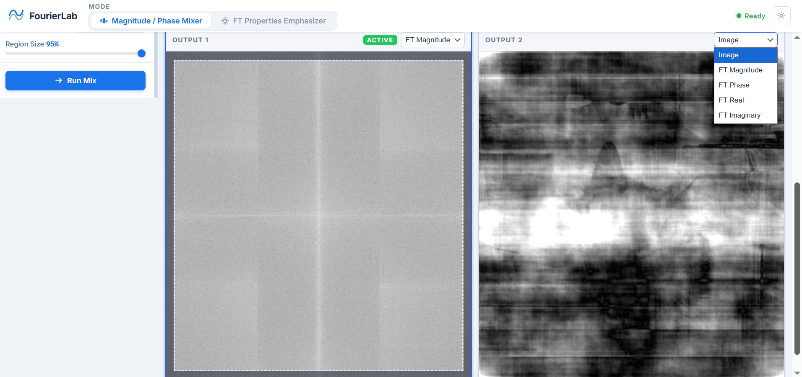
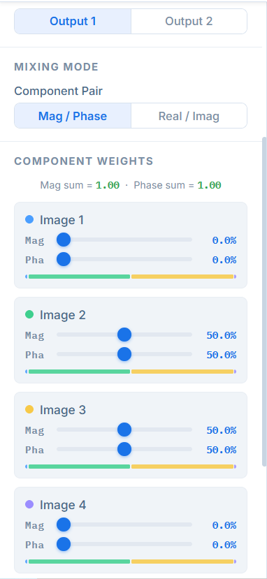
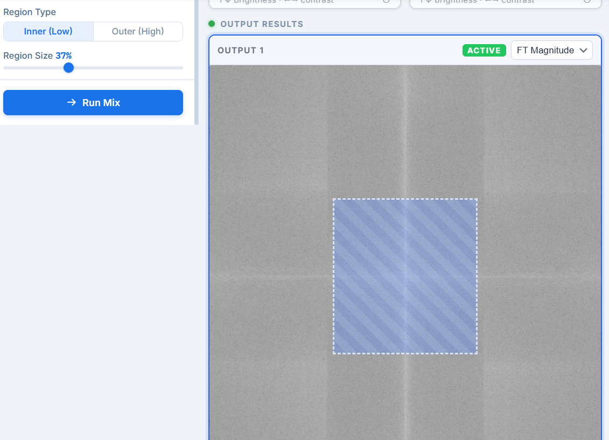
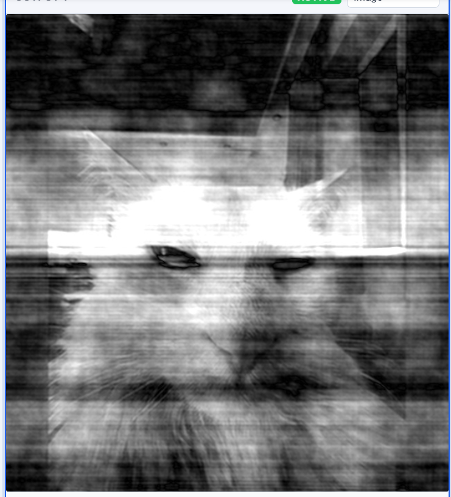
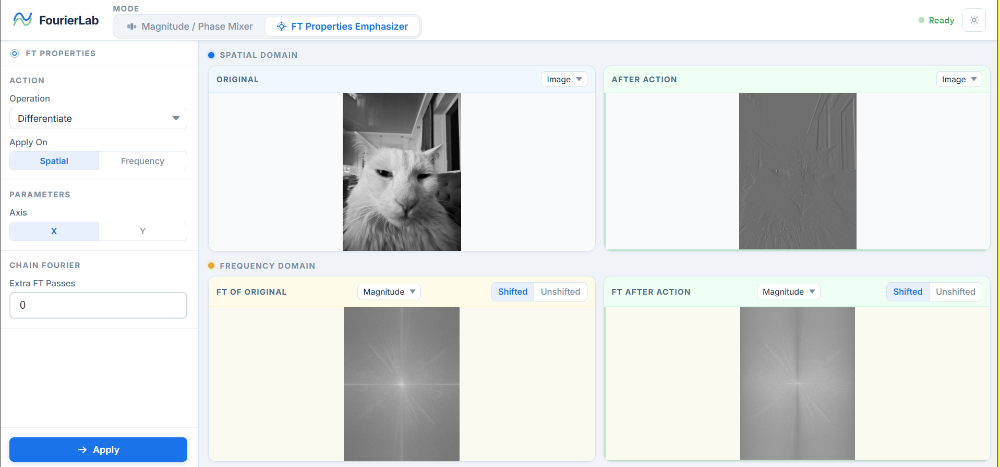

# 🖼️ Fourier Transform Mixer & Properties Emphasizer

A full-stack web application built with **Angular (Frontend)** and **FastAPI (Backend)** that demonstrates the importance of **Fourier Transform components (Magnitude & Phase)** and visualizes **Fourier properties** on images interactively.

---

## 📋 Table of Contents

- [Overview](#overview)
- [Features](#features)
- [Mixer Module](#mixer-module)
- [Properties Emphasizer Module](#properties-emphasizer-module)
- [UI Screenshots](#ui-screenshots)
- [Demo Videos](#demo-videos)
- [Installation](#installation)
- [Usage](#usage)
- [Project Structure](#project-structure)

---

## Overview

This application helps users understand how images are represented in the **frequency domain** using Fourier Transform.

It allows:
- Mixing FT components from multiple images
- Exploring magnitude vs phase importance
- Applying Fourier properties interactively

---

## Features

### 🔹 General
- Open and display **4 input images**
- Unified resizing (smallest / largest / custom)
- Interactive UI with real-time updates
- Two output viewports

---

## Mixer Module

### 🎚️ FT Magnitude / Phase Mixer

Users can mix Fourier components from multiple images.

### Features:

- Display for each image:
  - Original Image
  - FT Components:
    - Magnitude
    - Phase
    - Real
    - Imaginary

- Adjustable sliders:
  - Control contribution (weights) of each image

- Output:
  - Result shown in selectable output viewport
  - Computed using inverse FFT (IFFT)

---

### 🧩 Region-Based Mixing

- Select region in frequency domain:
  - Inner (Low Frequencies)
  - Outer (High Frequencies)

- Rectangle selection:
  - Adjustable size
  - Highlighted region

- Unified region across all images

---

### ⚡ Real-Time Processing

- Progress bar during mixing
- Cancel previous operation if new update occurs
- Optional delay simulation (for testing performance)

---

## Properties Emphasizer Module

A separate mode to demonstrate **Fourier Transform properties**.

---

### 🎯 Supported Operations

1. Shift (X & Y directions)
2. Multiply by complex exponential
3. Stretch (Scaling)
4. Mirror (Symmetry)
5. Even / Odd transformation
6. Rotation (0° → 360°)
7. Differentiation
8. Integration
9. Windowing:
   - Rectangular
   - Gaussian
   - Hamming
   - Hanning
10. Repeated Fourier Transform

---

### 🔄 Dual Domain Visualization

- Spatial Domain:
  - Original Image
  - Modified Image

- Frequency Domain:
  - FT of original
  - FT after modification

- Changes reflect **instantly between domains**

---

### 🎛️ Interactive Controls

- Dropdown to select operation
- Dynamic parameters per operation
- Apply operation on:
  - Spatial domain OR
  - Frequency domain

---

## UI Screenshots

> 📸 **Main Interface**
>
> 
> *Caption: Full application layout showing input images, FT views, and outputs.*

---

> 📸 **FT Components View**
>
> 
> *Caption: Magnitude, Phase, Real, and Imaginary views.*

---

> 📸 **Mixer Sliders**
>
> 
> *Caption: Sliders controlling weights of each image.*

---

> 📸 **Region Selection**
>
> 
> *Caption: Selecting inner/outer frequency regions.*

---

> 📸 **Output Result**
>
> 
> *Caption: Result after mixing FT components.*

---

> 📸 **Properties Mode**
>
> 
> *Caption: Applying FT properties on spatial & frequency domains.*

---

## 🎥 Demo Videos

> 🎬 **Full System Overview**
>
> https://github.com/user-attachments/assets/86e1dd27-acf2-4f9b-9f5f-e3c0d79bbd24

---

> 🎬 **Mixer Module Demo**
>
> https://github.com/user-attachments/assets/99e5a9f0-0fe6-4e6b-ab68-8940b17032a1

---

> 🎬 **Properties Emphasizer Demo**
>
> https://github.com/user-attachments/assets/6944c970-b617-465c-b6cf-9529fa94a8e1

---

## Installation

### Backend (FastAPI)

```bash
cd backend
pip install -r requirements.txt
uvicorn main:app --reload
```

---

### Frontend (Angular)

```bash
cd frontend
npm install
ng serve
```

---

## Usage

1. Run backend (port 8000)
2. Run frontend (port 4200)
3. Open the app in browser
4. Upload up to 4 images
5. Choose:
   - **Mixer Mode** → mix FT components  
   - **Properties Mode** → apply transformations  
6. Adjust sliders / parameters  
7. Observe results in real-time  

---

## Project Structure

```bash
project-root/
│
├── frontend/        # Angular App
│   ├── components/
│   ├── services/
│   └── views/
│
├── backend/         # FastAPI App
│   ├── routes/
│   ├── services/
│   └── utils/
│
├── Screenshots/
├── Videos/
└── README.md
```

---

## 🧠 Key Learning Outcomes

- Importance of **Phase vs Magnitude**  
- Understanding **frequency domain representation**  
- Visualization of **Fourier properties**  
- Hands-on experience with **FFT & IFFT**  

---

## License

Developed as part of a **DSP / Biomedical Signal Processing course project**.
